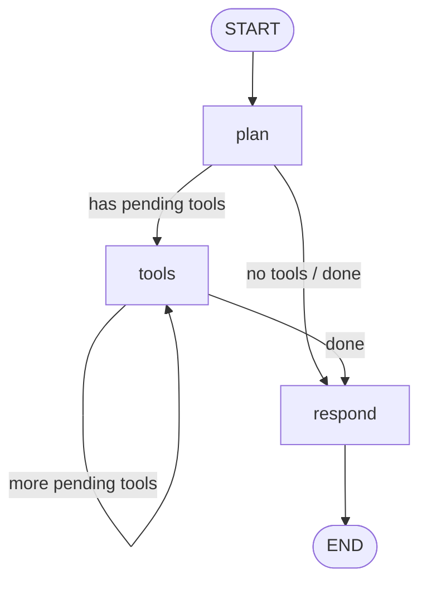

# langgraph-eval-demo

> **OSS / learning demo only.** This is a personal open-source teaching project by [vk-ai](https://github.com/vk-ai). It is **not** employer production software, is **not** affiliated with any employer, and must not be described as production agent infrastructure.

```text
╔══════════════════════════════════════════════════════════════════════════╗
║  HONESTY BANNER                                                          ║
║  Default backend: [langgraph-style] — a thin *stdlib* StateGraph         ║
║  stand-in. This is NOT LangGraph, NOT LangSmith, and NOT employer        ║
║  production eval / agent infra. Optional real LangGraph is opt-in only.  ║
╚══════════════════════════════════════════════════════════════════════════╝
```

Tiny **multi-step tool-calling agent** built on a thin LangGraph-*style* state graph (pure Python, **zero required runtime deps**), plus a **golden-task eval harness** and **pytest** suite that fails on regression. An optional real-`langgraph` path exists behind an env flag for learners who want to compare APIs.

## Why

LangGraph’s mental model (nodes → edges → conditional routing → compiled graph) is powerful — but for learning and CI you often want:

- **No API keys / no network** in the critical path
- **Deterministic** tool traces you can golden-test
- A harness that **breaks the build** when tool order or answers drift

This repo is that slice.

## What’s inside

| Piece | Role |
|---|---|
| `src/langgraph_eval_demo/graph.py` | Thin `StateGraph` / `END` / `compile().invoke()` (stdlib only) — tagged `[langgraph-style]` |
| `src/langgraph_eval_demo/langgraph_backend.py` | Optional real `langgraph` graph (same plan→tools→respond) — tagged `[langgraph]` |
| `src/langgraph_eval_demo/backend.py` | Mode / label helpers (`graph_mode`, `backend_label`) |
| `src/langgraph_eval_demo/agent.py` | Plan → tools\* → respond agent + `run_agent` router |
| `src/langgraph_eval_demo/tools.py` | Mock `search`, `calculator`, `weather` (+ optional fixture replay) |
| `src/langgraph_eval_demo/fixtures.py` | Arg digests + frozen tool-result catalog lookup |
| `evals/tool_fixtures/catalog.json` | Record/replay mock tool outputs keyed by arg digest |
| `evals/golden_tasks.json` | Frozen tasks: tool sequence + answer + optional arg digests |
| `evals/runner.py` | Eval runner + markdown report |
| `tests/` | Unit + golden tests (pytest fails on regression; no langgraph required) |
| `.github/workflows/ci.yml` | GitHub Actions CI (`pip install -e ".[dev]"` + pytest; never installs real langgraph) |

## Quickstart

```bash
git clone https://github.com/vk-ai/langgraph-eval-demo.git
cd langgraph-eval-demo
python -m venv .venv && source .venv/bin/activate
pip install -e ".[dev]"
pytest -q
python examples/quickstart.py
python evals/runner.py
```

Example agent run (default offline path):

```text
backend: [langgraph-style]  (mode=langgraph-style)

Q: Find the population of Tokyo then multiply that by 2
  backend: [langgraph-style]
  tools:   ['search', 'calculator']
  answer:  Tokyo has approximately 14 million people. Multiplied result: 28000000.
```

### Optional real LangGraph (opt-in)

The **default** path is offline and clearly labeled `[langgraph-style]` — a ~100-line stdlib stand-in. CI and `pytest` never require the real package.

To attempt a real LangGraph `StateGraph`:

1. Install the optional extra: `pip install '.[langgraph]'` (pins `langgraph>=0.2`)
2. Set **`LANGGRAPH_EVAL_USE_REAL=true`** (default is unset / false)

Successful real runs are labeled `[langgraph]` in the result snapshot (`graph_mode`, `backend_label`, and messages). If `langgraph` is missing or invoke fails, `run_agent` **falls back** to `[langgraph-style]` with a clear reason in `messages` — it does **not** crash.

```bash
pip install -e '.[langgraph]'
LANGGRAPH_EVAL_USE_REAL=true python examples/quickstart.py
```

This optional path is for learning how the same plan→tools→respond shape looks on the real package. It is **not** a production LangGraph / LangSmith integration and makes no claims about any employer's systems.

## Graph shape

Default (and CI) path uses the **stdlib stand-in** in `graph.py`. The optional real backend builds the same topology.

ASCII:

```text
          ┌────────┐
   START →│  plan  │─── no tools ──────────────┐
          └───┬────┘                           │
              │ has tools                      ▼
              ▼                           ┌─────────┐
          ┌───────┐  more tools           │ respond │ → END
          │ tools │──────────────┐        └─────────┘
          └───┬───┘              │              ▲
              │ done             └──────────────┘
              └─────────────────────────────────┘
```

Mermaid (same topology; default runner is the stdlib `[langgraph-style]` stand-in):



## Golden eval (regression gate)

Tasks in `evals/golden_tasks.json` assert:

1. **Tool sequence** — exact ordered list (e.g. `["search", "calculator"]`)
2. **Final answer** — `exact` or `contains` match
3. **`max_tool_calls` budget** — fail the eval/CI if the agent exceeds the per-task tool-call budget (optional related `max_graph_steps` is also supported by the runner)
4. **Optional `expected_tool_args` digests** — SHA-256 of canonicalized (sorted-JSON) resolved tool args; fail on mismatch
5. **Frozen tool-result fixtures** — `evals/tool_fixtures/catalog.json` locks mock outputs; CI fails if a tool returns a different string for a known arg digest

This mirrors a common community wish for agent CI: catch runaway tool loops **and** tool-environment drift (record/replay), even when the answer string still looks fine (see EvalView-style `max_cost` / “freeze the tool results as fixtures” stories on r/LangChain and DEV).

Set `LANGGRAPH_EVAL_USE_FIXTURES=1` to replay catalog outputs from `call_tool` (optional; evals verify fixtures regardless).

```bash
pytest tests/test_eval.py -q
```

If the agent starts skipping tools, looping tools, or changing answers, CI goes red.

> **Honesty:** default path is a stdlib LangGraph-*style* graph + mock tools only — **not** real LangGraph, **not** LangSmith, **not** employer production eval infra. Snapshot field `backend_label` is `[langgraph-style]` unless you explicitly opt into real LangGraph.

## Design notes

- **Prefer zero deps:** the graph is a ~100-line LangGraph-style stand-in so learners can read every line. Real `langgraph` is an **optional** extra (`pip install '.[langgraph]'`) behind `LANGGRAPH_EVAL_USE_REAL` — never a required dependency.
- **Loud labels:** every `run_agent` snapshot includes `graph_mode` and `backend_label` (`[langgraph-style]` or `[langgraph]`).
- **Deterministic planner:** no LLM in the loop — queries are mapped to tool plans with lightweight heuristics so golden tests are stable.
- **Mock tools only:** search / calculator / weather never hit the network.
- **CI stays offline:** `.github/workflows/ci.yml` installs `.[dev]` only; real LangGraph is never required.

## License

MIT — see [LICENSE](LICENSE).

## CI

GitHub Actions workflow: [`.github/workflows/ci.yml`](.github/workflows/ci.yml) (mirrored at [`ci/github-actions.yml`](ci/github-actions.yml)).

Runs on push/PR to `main`:

```bash
pip install -e ".[dev]"
pytest -q
python evals/runner.py
```

Fully offline — no network, no LangGraph package, no API keys.
